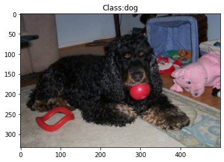
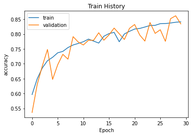

# CatDog_Classification
實作kaggle - Dogs vs. Cats: 
https://www.kaggle.com/c/dogs-vs-cats/code?competitionId=3362&amp;sortBy=dateRun&amp;tab=profile

```python
from tensorflow.python.client import device_lib
print(device_lib.list_local_devices())
```

    [name: "/device:CPU:0"
    device_type: "CPU"
    memory_limit: 268435456
    locality {
    }
    incarnation: 7564468955766629336
    , name: "/device:GPU:0"
    device_type: "GPU"
    memory_limit: 15701340352
    locality {
      bus_id: 1
      links {
      }
    }
    incarnation: 1697848382704529566
    physical_device_desc: "device: 0, name: Tesla P100-PCIE-16GB, pci bus id: 0000:00:04.0, compute capability: 6.0"
    ]
    


```python
# all import
import json
import zipfile
import os
import numpy as np
from matplotlib import pyplot as plt
from matplotlib.image import imread
import pandas as pd
from sklearn.model_selection import train_test_split
from keras.preprocessing.image import ImageDataGenerator, img_to_array, load_img
from tensorflow import keras
from keras.models import Sequential
from keras.layers import Dense, Dropout, Conv2D, MaxPool2D, Flatten, BatchNormalization, Activation
from keras.callbacks import EarlyStopping, ReduceLROnPlateau
import tensorflow as tf
```


```python
# https://blog.toright.com/posts/6817/%E5%A6%82%E4%BD%95%E5%9C%A8-colab-%E4%B8%AD%E9%80%8F%E9%81%8E-kaggle-api-%E4%B8%8B%E8%BC%89%E8%B3%87%E6%96%99%E9%9B%86.html
api_token = {"username":"tmum610109006","key":"37f40156c53fc2f1d990be6a1944af18"}
if not os.path.exists("/root/.kaggle"):
    os.makedirs("/root/.kaggle")
 
with open('/root/.kaggle/kaggle.json', 'w') as file:
    json.dump(api_token, file)
!chmod 600 /root/.kaggle/kaggle.json
 
if not os.path.exists("/kaggle"):
    os.makedirs("/kaggle")
os.chdir('/kaggle')
!kaggle competitions download -c dogs-vs-cats
 
!ls /kaggle
```

    Warning: Looks like you're using an outdated API Version, please consider updating (server 1.5.10 / client 1.5.4)
    Downloading test1.zip to /kaggle
     95% 257M/271M [00:01<00:00, 246MB/s]
    100% 271M/271M [00:01<00:00, 255MB/s]
    Downloading train.zip to /kaggle
     98% 531M/543M [00:02<00:00, 236MB/s]
    100% 543M/543M [00:02<00:00, 222MB/s]
    Downloading sampleSubmission.csv to /kaggle
      0% 0.00/86.8k [00:00<?, ?B/s]
    100% 86.8k/86.8k [00:00<00:00, 77.9MB/s]
    sampleSubmission.csv  test1.zip  train.zip
    


```python
def zip_list(file_path):
    zf = zipfile.ZipFile(file_path, 'r')
    zf.extractall()
    print('unzip!')


if __name__ == '__main__':
    file_path_train = '../kaggle/train.zip'
    file_path_test = '../kaggle/test1.zip'
    zip_list(file_path_train)
    zip_list(file_path_test)
```

    unzip!
    unzip!
    


```python
# https://stackoverflow.com/questions/52265978/how-to-delete-a-locally-uploaded-file-on-google-colab
%rm -rf /kaggle/test1.zip
%rm -rf /kaggle/train.zip
```


```python
test_images_dir = "../kaggle/test1/"
train_images_dir= "../kaggle/train/"
sample_sub_path = "../kaggle/sampleSubmission.csv"
```


```python
for i in range(1,3):
  plt.subplot(1,2,i)
  if i % 2 == 1:   
    filename = train_images_dir + 'cat.0.jpg'
  else:
    filename = train_images_dir + 'dog.0.jpg'
  image = imread(filename)
  plt.imshow(image)

plt.show()
```


```python
submit_example = pd.read_csv(sample_sub_path)
submit_example.head()
```


<div>
<style scoped>
    .dataframe tbody tr th:only-of-type {
        vertical-align: middle;
    }

    .dataframe tbody tr th {
        vertical-align: top;
    }

    .dataframe thead th {
        text-align: right;
    }
</style>
<table border="1" class="dataframe">
  <thead>
    <tr style="text-align: right;">
      <th></th>
      <th>id</th>
      <th>label</th>
    </tr>
  </thead>
  <tbody>
    <tr>
      <th>0</th>
      <td>1</td>
      <td>0</td>
    </tr>
    <tr>
      <th>1</th>
      <td>2</td>
      <td>0</td>
    </tr>
    <tr>
      <th>2</th>
      <td>3</td>
      <td>0</td>
    </tr>
    <tr>
      <th>3</th>
      <td>4</td>
      <td>0</td>
    </tr>
    <tr>
      <th>4</th>
      <td>5</td>
      <td>0</td>
    </tr>
  </tbody>
</table>
</div>


```python
# 參考: https://machinelearningmastery.com/how-to-develop-a-convolutional-neural-network-to-classify-photos-of-dogs-and-cats/
# train
imagedir = os.listdir(train_images_dir)
labels = []
for filename in imagedir:
  if filename.startswith('cat'):
    labels.append('cat')
  else:
    labels.append('dog')

# 使用 pandas 套件的 DataFrame() 方法將一個 dictionary 的資料結構轉換成 data frame
df = pd.DataFrame({"file":imagedir, "label":labels})

print(df.head())
print(df.tail())

# test
test_images_path = os.listdir(test_images_dir)
test_df = pd.DataFrame({'file':test_images_path})
print(test_df.head())
```

               file label
    0  dog.8911.jpg   dog
    1  dog.2041.jpg   dog
    2  dog.3159.jpg   dog
    3  cat.5291.jpg   cat
    4  cat.2948.jpg   cat
                    file label
    24995   cat.1128.jpg   cat
    24996  cat.11848.jpg   cat
    24997   cat.7102.jpg   cat
    24998   cat.9005.jpg   cat
    24999  dog.10361.jpg   dog
            file
    0  10786.jpg
    1   2273.jpg
    2   1278.jpg
    3   7563.jpg
    4   4056.jpg
    


```python
# 制作DataFrame的直方图
df['label'].hist()
```


    <matplotlib.axes._subplots.AxesSubplot at 0x7f4dd0235ed0>


```python
img_path = train_images_dir + df['file'][0]
label = df['label'][0]

img = imread(img_path)
plt.imshow(img)

plt.imshow(img)
plt.title("Class:"+label)
```


    Text(0.5, 1.0, 'Class:dog')





```python
df.shape
```


    (25000, 2)


```python
train_df, valid_df = train_test_split(df, test_size = 0.15)
print("Training set:", train_df.shape)
print("Validation set:", valid_df.shape)
```

    Training set: (21250, 2)
    Validation set: (3750, 2)
    

### ImageDataGenerator
#### data preprocessing
當前資料是以JPEG檔案的形式儲存在硬碟中，預處理步驟如下：
* 讀取影象檔案
* 將JPEG檔案解碼為RGB畫素網格
* 將畫素網格轉化為浮點數張量
* 將畫素值縮放到0~1區間

Keras提供自動完成preprocessing的工具：keras.preprocessing.image ImageDataGenerator類

```
from keras.preprocessing.image import ImageDataGenerator
train_datagen = ImageDataGenerator(rescale=1./255)

train_generator = train_datagen.flow_from_directory(
                train_dir, # 目標目錄
                target_size=(150, 150), # 所有影象調整為150x150
                batch_size=20,
                class_mode='binary') # 二進位制標籤，我們用了binary_crossentropy損失函式
```
#### Data augmentation（資料增強）

```
# 資料增強增加學習樣本
datagen = ImageDataGenerator(
    rotation_range=40, # 角度值，0~180，影象旋轉
    width_shift_range=0.2, # 水平平移，相對總寬度的比例
    height_shift_range=0.2, # 垂直平移，相對總高度的比例
    shear_range=0.2, # 隨機錯切換角度
    zoom_range=0.2, # 隨機縮放範圍
    horizontal_flip=True, # 一半影象水平翻轉
    fill_mode='nearest' # 填充新建立畫素的方法
)
```
from: https://www.itread01.com/content/1546542668.html


```python
# https://www.itread01.com/content/1546542668.html
train_gen = ImageDataGenerator(rescale = 1.0/255.0,
                horizontal_flip = True,
                vertical_flip   = True,
                fill_mode = 'nearest',
                rotation_range = 10,
                width_shift_range = 0.2,
                height_shift_range= 0.2,
                shear_range= 0.15,
                brightness_range= (.5,1.2),
                zoom_range = 0.2)

train_gen = train_gen.flow_from_dataframe(train_df,
                      directory = train_images_dir,
                      x_col = 'file', 
                      y_col = 'label', 
                      target_size =(128, 128), 
                      class_mode = 'categorical',  # one hot encoded
                      batch_size = 32, 
                      color_mode = 'rgb', 
                      shuffle = True)

valid_gen = ImageDataGenerator(rescale=1./255)
valid_gen = valid_gen.flow_from_dataframe(valid_df, 
                      directory = train_images_dir,
                      x_col='file',
                      y_col='label',
                      target_size =(128, 128),
                      class_mode='categorical',
                      batch_size=32)

test_gen = ImageDataGenerator(rescale=1.0/255.0)
test_gen = test_gen.flow_from_dataframe(test_df, 
                    directory=test_images_dir, 
                    x_col='file', 
                    y_col=None,
                    class_mode=None,
                    target_size=(128, 128),
                    color_mode="rgb",
                    shuffle = False)
```

    Found 21250 validated image filenames belonging to 2 classes.
    Found 3750 validated image filenames belonging to 2 classes.
    Found 12500 validated image filenames.
    


```python
def showImage(image_gen):
  for x_gens, y_gens in image_gen:
    print(x_gens.shape)
    x_gen_shape = x_gens.shape[1:]
    i = 0
    for sample_img, sample_class in zip(x_gens, y_gens):      
      plt.subplot(2,4,i+1)
      plt.title(f'Class:{np.argmax(sample_class)}')
      plt.axis('off')
      plt.imshow(sample_img)
      
      i += 1
      
      if i >= 8:
        break
    break

  plt.show()

showImage(train_gen)
```

    (32, 128, 128, 3)
    


```python
model = Sequential()
model.add(Conv2D(filters=32, kernel_size=3, input_shape=(128, 128, 3), padding='same'))
model.add(BatchNormalization())
model.add(Activation('relu'))
model.add(MaxPool2D(pool_size=2))
model.add(Dropout(0.2))

model.add(Conv2D(filters=64, kernel_size=3, padding='same'))
model.add(BatchNormalization())
model.add(Activation('relu'))
model.add(MaxPool2D(pool_size=2))
model.add(Dropout(0.2))

model.add(Conv2D(filters=128, kernel_size=3, padding='same'))
model.add(BatchNormalization())
model.add(Activation('relu'))
model.add(MaxPool2D(pool_size=2))
model.add(Dropout(0.2))

model.add(Flatten())
model.add(Dense(512))
model.add(BatchNormalization())
model.add(Activation('relu'))
model.add(Dropout(0.2))
model.add(Dense(2, activation='softmax'))
model.summary()
```

    Model: "sequential"
    _________________________________________________________________
    Layer (type)                 Output Shape              Param #   
    =================================================================
    conv2d (Conv2D)              (None, 128, 128, 32)      896       
    _________________________________________________________________
    batch_normalization (BatchNo (None, 128, 128, 32)      128       
    _________________________________________________________________
    activation (Activation)      (None, 128, 128, 32)      0         
    _________________________________________________________________
    max_pooling2d (MaxPooling2D) (None, 64, 64, 32)        0         
    _________________________________________________________________
    dropout (Dropout)            (None, 64, 64, 32)        0         
    _________________________________________________________________
    conv2d_1 (Conv2D)            (None, 64, 64, 64)        18496     
    _________________________________________________________________
    batch_normalization_1 (Batch (None, 64, 64, 64)        256       
    _________________________________________________________________
    activation_1 (Activation)    (None, 64, 64, 64)        0         
    _________________________________________________________________
    max_pooling2d_1 (MaxPooling2 (None, 32, 32, 64)        0         
    _________________________________________________________________
    dropout_1 (Dropout)          (None, 32, 32, 64)        0         
    _________________________________________________________________
    conv2d_2 (Conv2D)            (None, 32, 32, 128)       73856     
    _________________________________________________________________
    batch_normalization_2 (Batch (None, 32, 32, 128)       512       
    _________________________________________________________________
    activation_2 (Activation)    (None, 32, 32, 128)       0         
    _________________________________________________________________
    max_pooling2d_2 (MaxPooling2 (None, 16, 16, 128)       0         
    _________________________________________________________________
    dropout_2 (Dropout)          (None, 16, 16, 128)       0         
    _________________________________________________________________
    flatten (Flatten)            (None, 32768)             0         
    _________________________________________________________________
    dense (Dense)                (None, 512)               16777728  
    _________________________________________________________________
    batch_normalization_3 (Batch (None, 512)               2048      
    _________________________________________________________________
    activation_3 (Activation)    (None, 512)               0         
    _________________________________________________________________
    dropout_3 (Dropout)          (None, 512)               0         
    _________________________________________________________________
    dense_1 (Dense)              (None, 2)                 1026      
    =================================================================
    Total params: 16,874,946
    Trainable params: 16,873,474
    Non-trainable params: 1,472
    _________________________________________________________________
    


```python
model.compile(optimizer='adam', loss='categorical_crossentropy', metrics=['accuracy'])
```


```python
# To stop the training after N epochs and val_loss value not decreased
earlystop = EarlyStopping(patience=2)
# To reduce the learning rate when the accuracy not increase for 5 steps
learning_rate_reduction = ReduceLROnPlateau(monitor='val_accuracy', 
                      patience=2, 
                      verbose=1, 
                      factor=0.5, 
                      min_lr=0.0001)
```


```python
epochs = 30
history = model.fit(train_gen, 
          # steps_per_epoch = len(train_df)//32, 
          epochs = epochs, 
          validation_data = valid_gen, 
          # validation_steps = len(valid_df)//BATCH_SIZE
          )
```

    Epoch 1/30
    665/665 [==============================] - 163s 235ms/step - loss: 0.7911 - accuracy: 0.5741 - val_loss: 0.8577 - val_accuracy: 0.5363
    Epoch 2/30
    665/665 [==============================] - 154s 232ms/step - loss: 0.6421 - accuracy: 0.6428 - val_loss: 0.6713 - val_accuracy: 0.6304
    Epoch 3/30
    665/665 [==============================] - 153s 231ms/step - loss: 0.5955 - accuracy: 0.6797 - val_loss: 0.6313 - val_accuracy: 0.6928
    Epoch 4/30
    665/665 [==============================] - 153s 230ms/step - loss: 0.5717 - accuracy: 0.6966 - val_loss: 0.5129 - val_accuracy: 0.7480
    Epoch 5/30
    665/665 [==============================] - 153s 230ms/step - loss: 0.5509 - accuracy: 0.7164 - val_loss: 0.6982 - val_accuracy: 0.6475
    Epoch 6/30
    665/665 [==============================] - 154s 231ms/step - loss: 0.5268 - accuracy: 0.7321 - val_loss: 0.5944 - val_accuracy: 0.6968
    Epoch 7/30
    665/665 [==============================] - 153s 230ms/step - loss: 0.5236 - accuracy: 0.7376 - val_loss: 0.6016 - val_accuracy: 0.7317
    Epoch 8/30
    665/665 [==============================] - 154s 232ms/step - loss: 0.5027 - accuracy: 0.7526 - val_loss: 0.6041 - val_accuracy: 0.7155
    Epoch 9/30
    665/665 [==============================] - 153s 230ms/step - loss: 0.4903 - accuracy: 0.7664 - val_loss: 0.4535 - val_accuracy: 0.7912
    Epoch 10/30
    665/665 [==============================] - 154s 231ms/step - loss: 0.4837 - accuracy: 0.7699 - val_loss: 0.4726 - val_accuracy: 0.7731
    Epoch 11/30
    665/665 [==============================] - 152s 229ms/step - loss: 0.4702 - accuracy: 0.7773 - val_loss: 0.5045 - val_accuracy: 0.7632
    Epoch 12/30
    665/665 [==============================] - 153s 231ms/step - loss: 0.4642 - accuracy: 0.7851 - val_loss: 0.4867 - val_accuracy: 0.7789
    Epoch 13/30
    665/665 [==============================] - 155s 233ms/step - loss: 0.4620 - accuracy: 0.7774 - val_loss: 0.4597 - val_accuracy: 0.7789
    Epoch 14/30
    665/665 [==============================] - 154s 231ms/step - loss: 0.4812 - accuracy: 0.7723 - val_loss: 0.4291 - val_accuracy: 0.8043
    Epoch 15/30
    665/665 [==============================] - 153s 231ms/step - loss: 0.4427 - accuracy: 0.7931 - val_loss: 0.4873 - val_accuracy: 0.7792
    Epoch 16/30
    665/665 [==============================] - 152s 229ms/step - loss: 0.4384 - accuracy: 0.7992 - val_loss: 0.4781 - val_accuracy: 0.7971
    Epoch 17/30
    665/665 [==============================] - 155s 233ms/step - loss: 0.4237 - accuracy: 0.8101 - val_loss: 0.3965 - val_accuracy: 0.8200
    Epoch 18/30
    665/665 [==============================] - 154s 232ms/step - loss: 0.4501 - accuracy: 0.7906 - val_loss: 0.4431 - val_accuracy: 0.8008
    Epoch 19/30
    665/665 [==============================] - 151s 227ms/step - loss: 0.4434 - accuracy: 0.7907 - val_loss: 0.4737 - val_accuracy: 0.7816
    Epoch 20/30
    665/665 [==============================] - 153s 229ms/step - loss: 0.4217 - accuracy: 0.8049 - val_loss: 0.4413 - val_accuracy: 0.8192
    Epoch 21/30
    665/665 [==============================] - 153s 230ms/step - loss: 0.3954 - accuracy: 0.8220 - val_loss: 0.3731 - val_accuracy: 0.8320
    Epoch 22/30
    665/665 [==============================] - 150s 225ms/step - loss: 0.3981 - accuracy: 0.8203 - val_loss: 0.4398 - val_accuracy: 0.7965
    Epoch 23/30
    665/665 [==============================] - 152s 229ms/step - loss: 0.3893 - accuracy: 0.8269 - val_loss: 0.4924 - val_accuracy: 0.7763
    Epoch 24/30
    665/665 [==============================] - 149s 225ms/step - loss: 0.3788 - accuracy: 0.8314 - val_loss: 0.3595 - val_accuracy: 0.8387
    Epoch 25/30
    665/665 [==============================] - 151s 227ms/step - loss: 0.3708 - accuracy: 0.8331 - val_loss: 0.4414 - val_accuracy: 0.8021
    Epoch 26/30
    665/665 [==============================] - 149s 224ms/step - loss: 0.3750 - accuracy: 0.8369 - val_loss: 0.3867 - val_accuracy: 0.8144
    Epoch 27/30
    665/665 [==============================] - 150s 226ms/step - loss: 0.3703 - accuracy: 0.8357 - val_loss: 0.4968 - val_accuracy: 0.7755
    Epoch 28/30
    665/665 [==============================] - 150s 226ms/step - loss: 0.3708 - accuracy: 0.8348 - val_loss: 0.3460 - val_accuracy: 0.8515
    Epoch 29/30
    665/665 [==============================] - 151s 227ms/step - loss: 0.3605 - accuracy: 0.8376 - val_loss: 0.3296 - val_accuracy: 0.8613
    Epoch 30/30
    665/665 [==============================] - 154s 231ms/step - loss: 0.3606 - accuracy: 0.8392 - val_loss: 0.3782 - val_accuracy: 0.8341
    

###  EarlyStopping
patience：能夠容忍多少個epoch內都沒有improvement

from: https://medium.com/ai%E5%8F%8D%E6%96%97%E5%9F%8E/learning-model-earlystopping%E4%BB%8B%E7%B4%B9-%E8%BD%89%E9%8C%84-f364f4f220fb

### ReduceLROnPlateau


* monitor：監測的值，可以是accuracy，val_loss,val_accuracy
* factor：縮放學習率的值，學習率將以lr = lr*factor的形式被減少
* patience：當patience個epoch過去而模型性能不提升時，學習率減少的動作會被觸发
* mode：‘auto’，‘min’，‘max’之一 默認‘auto’就行
* epsilon：閾值，用來確定是否進入檢測值的“平原區”
* cooldown：學習率減少後，會經過cooldown個epoch才重新進行正常操作
* min_lr：學習率最小值，能縮小到的下限

from: https://blog.csdn.net/weixin_44048809/article/details/105711356

```
from keras.callbacks import EarlyStopping, ReduceLROnPlateau

earlystop = EarlyStopping(patience=2)
learning_rate_reduction = ReduceLROnPlateau(monitor='val_acc', 
                      patience=2, 
                      verbose=1, 
                      factor=0.5, 
                      min_lr=0.0001)
                      factor=0.5, 
                      min_lr=0.0001)
```


```python
model.save_weights('../kaggle/weights/weights_cat_dog.h5')
```


```python
print(history.history.keys())
print("Acc:", history.history['accuracy'][-1])
print("Val Acc:", history.history['val_accuracy'][-1])
```

    dict_keys(['loss', 'accuracy', 'val_loss', 'val_accuracy'])
    Acc: 0.8409411907196045
    Val Acc: 0.8341333270072937
    


```python
def show_train_history(train_history, train, validation, title):  
    plt.plot(train_history.history[train])  
    plt.plot(train_history.history[validation])  
    plt.title(title)  
    plt.ylabel(train)  
    plt.xlabel('Epoch')  
    plt.legend(['train', 'validation'], loc='upper left')  
    plt.show()  
show_train_history(history, 'accuracy', 'val_accuracy', 'Train History') 
show_train_history(history, 'loss', 'val_loss', 'Loss History')  
```





```python
def num2cat(num):
  if num == 0:
    return 'cat'
  else:
    return 'dog'

predictions = model.predict(test_gen)
predictions = np.argmax(predictions,axis=1)


for i, file in enumerate(test_df['file'][:12]):
  img = imread(test_images_dir+file)  
  plt.subplot(3,4, i+1)
  plt.imshow(img)
  plt.title(f"Class:{num2cat(predictions[i])}")
  plt.axis('off')
  plt.imshow(img)

plt.show()
```


```python
# Iterate thru all the layers of the model
# https://towardsdatascience.com/convolutional-neural-network-feature-map-and-filter-visualization-f75012a5a49c
for layer in model.layers:
  if 'conv' in layer.name:
      weights, bias= layer.get_weights()
      print(layer.name)
      
      #normalize filter values between  0 and 1 for visualization
      f_min, f_max = weights.min(), weights.max()
      # print(f_max, f_min)
      filters = (weights - f_min) / (f_max - f_min)  
      print(filters.shape[3])
      filter_cnt=1
      
      #plotting all the filters
      for i in range(filters.shape[3]):
          #get the filters
          filt=filters[:,:,:, i]
          #plotting each of the channel, color image RGB channels
          for j in range(filters.shape[0]):
            ax= plt.subplot(filters.shape[3]/2, filters.shape[0]*2, filter_cnt)
            ax.set_xticks([])
            ax.set_yticks([])
            plt.imshow(filt[:,:, j])
            filter_cnt+=1
      plt.show()
```

    conv2d
    32
    


    conv2d_1
    64
    


    conv2d_2
    128
    


#### Visualizing Feature maps or Activation maps generated in a CNN

Visualizing Feature maps步驟:

1. 定義一個新模型visualization_model，輸入為image，輸出將是feature map (為第一層之後的所有層的中間表示(intermediate representation))，這是基於我們用於訓練的模型。
2. 載入要visualize的input image，以了解突出顯示哪些特徵以對圖像進行分類。
3. 將圖像轉換為NumPy array
4. rescaling (作Normalize)
5. 通過可視化模型運行輸入圖像以獲取所有圖像輸入圖像的中間表示。
6. 為所有convolutional layers 和 the max pool layers (不包含fully connected layer)繪製feature map


```python
img_path = test_images_dir + '2.jpg' 
image = imread(img_path)
plt.imshow(image)
```


    <matplotlib.image.AxesImage at 0x7f4d427fe390>


```python
# Define a new Model
# Input= image 
# Output= intermediate representations for all layers in the previous model after the first.
successive_outputs = [layer.output for layer in model.layers[1:]]

#visualization_model = Model(img_input, successive_outputs)
visualization_model = tf.keras.models.Model(inputs = model.input, outputs = successive_outputs)

img = load_img(img_path, target_size=(128, 128))

x = img_to_array(img)                           
x = x.reshape((1,) + x.shape)
x /= 255.0

# Let's run input image through our vislauization network
# to obtain all intermediate representations for the image.
successive_feature_maps = visualization_model.predict(x)
# Retrieve are the names of the layers, so can have them as part of our plot
layer_names = [layer.name for layer in model.layers]
for layer_name, feature_map in zip(layer_names, successive_feature_maps):
  print(feature_map.shape)
  if len(feature_map.shape) == 4:
    
    # Plot Feature maps for the conv / maxpool layers, not the fully-connected layers

    n_features = feature_map.shape[-1]  # number of features in the feature map
    size = feature_map.shape[1]  # feature map shape (1, size, size, n_features)
    
    # We will tile our images in this matrix
    display_grid = np.zeros((size, size * n_features))
    
    # Postprocess the feature to be visually palatable
    for i in range(n_features):
      x  = feature_map[0, :, :, i]
      x -= x.mean()
      x /= x.std()
      x *= 64
      x += 128
      x = np.clip(x, 0, 255).astype('uint8')
      # Tile each filter into a horizontal grid
      display_grid[:, i * size : (i + 1) * size] = x


    scale = 20. / n_features
    plt.figure(figsize=(scale * n_features, scale))
    plt.title(layer_name)
    plt.grid (False)
    plt.imshow(display_grid, aspect='auto', cmap='viridis')
```

    WARNING:tensorflow:5 out of the last 786 calls to <function Model.make_predict_function.<locals>.predict_function at 0x7f4d42740e60> triggered tf.function retracing. Tracing is expensive and the excessive number of tracings could be due to (1) creating @tf.function repeatedly in a loop, (2) passing tensors with different shapes, (3) passing Python objects instead of tensors. For (1), please define your @tf.function outside of the loop. For (2), @tf.function has experimental_relax_shapes=True option that relaxes argument shapes that can avoid unnecessary retracing. For (3), please refer to https://www.tensorflow.org/guide/function#controlling_retracing and https://www.tensorflow.org/api_docs/python/tf/function for  more details.
    (1, 128, 128, 32)
    (1, 128, 128, 32)
    (1, 64, 64, 32)
    (1, 64, 64, 32)
    (1, 64, 64, 64)
    (1, 64, 64, 64)
    (1, 64, 64, 64)
    (1, 32, 32, 64)
    (1, 32, 32, 64)
    (1, 32, 32, 128)
    (1, 32, 32, 128)
    (1, 32, 32, 128)
    (1, 16, 16, 128)
    (1, 16, 16, 128)
    (1, 32768)
    (1, 512)
    (1, 512)
    (1, 512)
    (1, 512)
    (1, 2)
    

    /usr/local/lib/python3.7/dist-packages/ipykernel_launcher.py:36: RuntimeWarning: invalid value encountered in true_divide
    


```python

```
